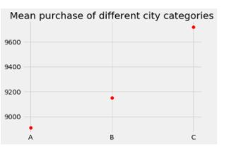

# Black-Friday-Sales-Prediction 

## Business Context

This dataset comprises of transactions made by a user during Black Friday Sale at a retail store. One way to increase the profit is by targeting customers based on their purchase history.

So, what we are trying to achieve is to try and predict the purchase amounts of given customers for particular product category. This data can be used to strategise promotional offers to be given to the customers.

## Objective

The aim is to build a predictive model and find out the purchase amount of a particular user given Gender, Age, Occupation, Stay in City, City Category, Product Category and so on. 

This is a supervised machine learning problem with a target label as “Purchase” Also since we are expected to predict a predict the sale price for a given product, it becomes a regression task.

## Dataset Information

| Column ID |         Column Name        | Data type |           Description           | Masked |
|:---------:|:--------------------------:|:---------:|:-------------------------------:|--------|
|     0     |           User_ID          |   int64   |      Unique Id of customer      | False  |
|     1     |         Product_ID         |   object  |       Unique Id of product      | False  |
|     2     |           Gender           |   object  |         Gender of customer         | False  |
|     3     |             Age            |   object  |         Age of customer         | False  |
|     4     |         Occupation         |   int64   |   Occupation code of customer   | True   |
|     5     |        City_Category       |   object  |         City of customer        | True   |
|     6     | Stay_In_Current_City_Years |   object  | Number of years of stay in city | False  |
|     7     |       Marital_Status       |   int64   |    Marital status of customer   | False  |
|     8     |     Product_Category_1     |   int64   |       Category of product       | True   |
|     9     |     Product_Category_2     |  float64  |       Category of product       | True   |
|     10    |     Product_Category_3     |  float64  |       Category of product       | True   |
|     11    |          Purchase          |   int64   |         Purchase amount         | False  |

## Exploratory Data Analysis

## Outlier Detection and Treatment

## Correlation Matrix

From the heatmap above we can observe there are strong correlations between different types' products and purchase. There is also some correlation between age and marital status which is in line with common sense. Unfortunately, there is no single feature that shows strong correlation with purchase directly, so we can understand this as that purchase depends on the ensemble of all features.

## Feature Engineering

1. For categorical columns, 'Gender', 'Age',  'City_Category',  'Stay_In_Current_City_Years' , dummies were created.  
2. The outliers in ‘Purchase’ column were treated by IQR method.  
3. Unique entry columns ‘User ID’ and ‘Product ID’ were dropped  

Missing Values:  
4. Product Category 2: The missing values were imputed with a common negative value, so that the model can interpret it as a different category.  
5. Product Category 3: The missing values were Imputed with a common negative value, so that the model can interpret it as a different category.  

## Model Training and Evaluation:

The ML models trained were:  
1. Linear Regression   
2. Decision Tree Regressor   
3. Random Forest Regressor  

Random Forest Regressor gave the best results:  

Model Report  
MSE: 3042.671349563994  
CV Score: 3033.229337898745  

The results obtained were not that great and can be surely improved by performing hyperparameter optimisation and techniques like Stacking.  

Feature Importances: 

